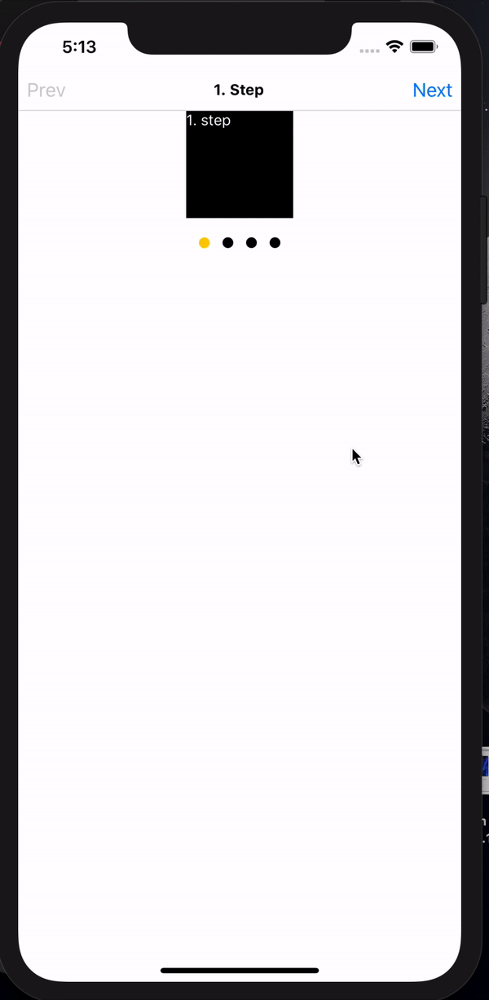

# React Native Wizard

Easy, convenient, quick-forming Wizard component for React Native.  Also this package is providing simple usage with few props and functions. You can see examples below the page.

<p align='center'></p>


## v2.0.0 Released. _This is a fresh start. :)_
With _v2.0.0_ almost everything changed.
- 5 animation added.
- Next step / prev step animation props added.
- Transition issues solved, duration props work well.
- Last step, first step callbacks added.
- Step change callback added. `currentStep(({currentStep, isLastStep, isFirstStep})=>{})`
- onFinish callback removed. You can easily use `isLastStep` for this callback.

## Getting Started

**With NPM**

```
npm install --save react-native-wizard
```

**With YARN**

```
yarn add react-native-wizard
```

## Props

| Props                 |Description|Type|Required|Default|
|-----------------------|-----------------------|------|--------|-------|
|activeStep             |For setting active step at start.|`int`|**No**|`0`|
|ref                    |You need to set ref for using some function like `goTo()`, `next()` etc.|`void`|**Yes**|-|
|currentStep            |You can get current step index. Also you can get that step is last step or first step. Also you can use isFirstStep and isLastStep callbacks.|`void`|**No**|-|
|isFirstStep            |You can get active step is first step or not with this callback. This callback is returning `boolean` value|`void`|**No**|-|
|isLastStep             |You can get active step is last step or not with this callback. This callback is returning `boolean` value|`void`|**No**|-|
|duration               |You can set duration of transition animation.|`int`|**No**|`500`|
|onNext                 |If next button click and step is change, this function will run.|`void`|**No**|-|
|onPrev                 |If prev button click and step is change, this function will run.|`void`|**No**|-|
|steps                  |You can set steps with this prop.|`object`|**Yes**|-|
|nextStepAnimation      |You can set animation for next step transition.|`string`|**No**|`fade`|
|prevStepAnimation      |You can set animation for prev step transition.|`string`|**No**|`fade`|
|containerStyles        |You can set styles for the parent View.|`ViewStyle`|**No**|-|

## Animations (`nextStepAnimation="fade"`)
You can use this animations for `prevStep` or `nextStep`

|Animation List|
|-----------------|
|`fade`           |
|`slideLeft`      |
|`slideRight`     |
|`slideUp`        |
|`slideDown`      |


## Reference Functions

**With functional component and hooks**
I sincerely recommend using `hooks`.
```javascript
import React, {useRef} from 'react'
const wizard = useRef(null)
// Usage
<Wizard ref={wizard} />
```

**With class component**
If you're not using functional component so you should create a ref with `React.createRef()`.
```javascript
wizard = React.createRef()
<Wizard ref={this.wizard} />
```

| Props                 |Usage _without_ useRef | Usage _with_ useRef|
|-----------------------|-----------------------|-------------------------|
|next()                 |this.wizard.current.next() | wizard.current.next()|
|prev()                 |this.wizard.current.prev() | wizard.current.prev() |
|goTo(`stepIndex`)      |this.wizard.current.goTo(`stepIndex`) |wizard.current.goTo(`stepIndex`)|

## Understanding the usage of Step

This wizard using your component class/function as a child. Every time this Wizard rendering your active step.

## Example App

You can find the usage example of the package in the example folder.

```sh
git clone https://github.com/talut/react-native-wizard

cd react-native-wizard/example

npm install

react-native run-ios/android
```

## Basic Usage

```javascript
import React, {useRef,useState} from 'react'
// import Wizard
import Wizard from "react-native-wizard"

// Import your own step components
import Step1 from "./yourStepsDir/Step1";
import Step2 from "./yourStepsDir/Step2";
import Step3 from "./yourStepsDir/Step3";

// ...

const wizard = useRef();
const [isFirstStep, setIsFirstStep] = useState()
const [isLastStep, setIsLastStep] = useState()
const stepList = [
    {
      content: <Image source={{uri: "http://placehold.it/96x96"}} style={{width:50, height:50}}/>,
    },
    {
      content: <Step2 testProp="Welcome to Second Step"/>
    },
    {
      content: <Step3 step3Prop="Welcome to Third Step"/>
    },
   ]
   <Wizard
        ref={wizard}
        activeStep={0}
        steps={stepList}
        isFirstStep={val => setIsFirstStep(val)}
        isLastStep={val => setIsLastStep(val)}
        onNext={() => {
            console.log("Next Step Called")
        }}
        onPrev={() => {
            console.log("Previous Step Called")
        }}
        currentStep={({ currentStep, isLastStep, isFirstStep }) => {
            setCurrentStep(currentStep)
        }}
    />
```

## Advanced Usage Example

```javascript
import React, { useRef, useState } from "react"
import { SafeAreaView, Button, View, Text } from "react-native"
import Wizard from "react-native-wizard"

export default () => {
  const wizard = useRef()
  const [isFirstStep, setIsFirstStep] = useState(true)
  const [isLastStep, setIsLastStep] = useState(false)
  const [currentStep, setCurrentStep] = useState(0)
  const stepList = [
    {
      content: <View style={{ width: 100, height: 100, backgroundColor: "#000" }} />,
    },
    {
      content: <View style={{ width: 100, height: 100, backgroundColor: "#e04851" }} />,
    },
    {
      content: <View style={{ width: 100, height: 500, backgroundColor: "#9be07d" }} />,
    },
    {
      content: <View style={{ width: 100, height: 100, backgroundColor: "#2634e0" }} />,
    },
  ]

  return (
    <View>
      <SafeAreaView style={{ backgroundColor: "#FFF" }}>
        <View
          style={{
            justifyContent: "space-between",
            flexDirection: "row",
            backgroundColor: "#FFF",
            borderBottomColor: "#dedede",
            borderBottomWidth: 1,
          }}>
          <Button disabled={isFirstStep} title="Prev" onPress={() => wizard.current.prev()} />
          <Text>{currentStep + 1}. Step</Text>
          <Button disabled={isLastStep} title="Next" onPress={() => wizard.current.next()} />
        </View>
      </SafeAreaView>
      <View style={{ flexDirection: "column", alignItems: "center", justifyContent: "center" }}>
        <Wizard
          ref={wizard}
          steps={stepList}
          isFirstStep={val => setIsFirstStep(val)}
          isLastStep={val => setIsLastStep(val)}
          onNext={() => {
            console.log("Next Step Called")
          }}
          onPrev={() => {
            console.log("Previous Step Called")
          }}
          currentStep={({ currentStep, isLastStep, isFirstStep }) => {
            setCurrentStep(currentStep)
          }}
        />
        <View style={{ flexDirection: "row", margin: 18 }}>
          {stepList.map((val, index) => (
            <View
              key={"step-indicator-" + index}
              style={{
                width: 10,
                marginHorizontal: 6,
                height: 10,
                borderRadius: 5,
                backgroundColor: index === currentStep ? "#fc0" : "#000",
              }}
            />
          ))}
        </View>
      </View>
    </View>
  )
}
```

## License

This project is licensed under the MIT License - see the [LICENSE.md](LICENSE.md) file for details
